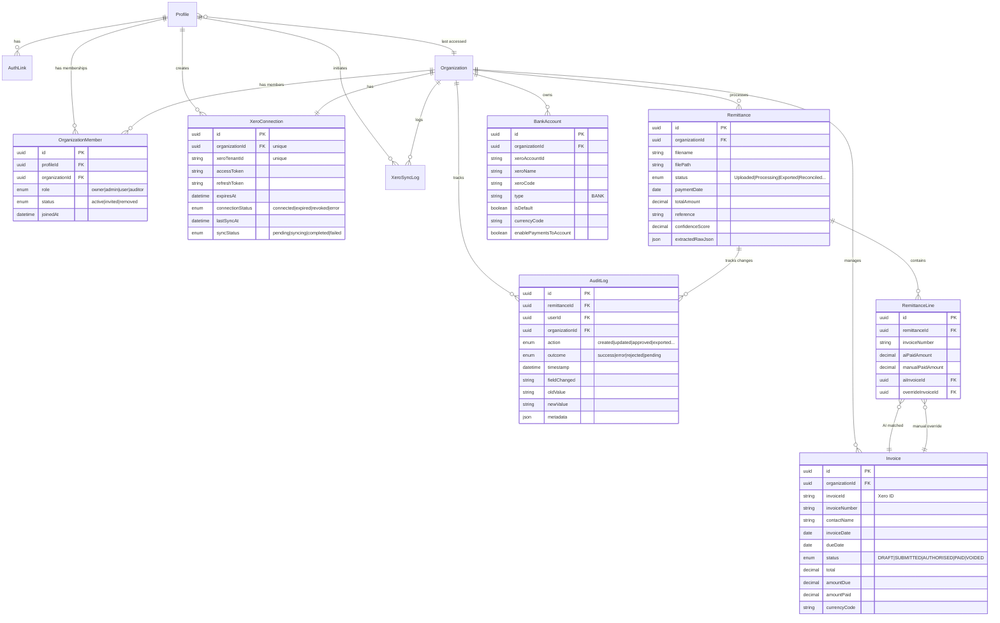
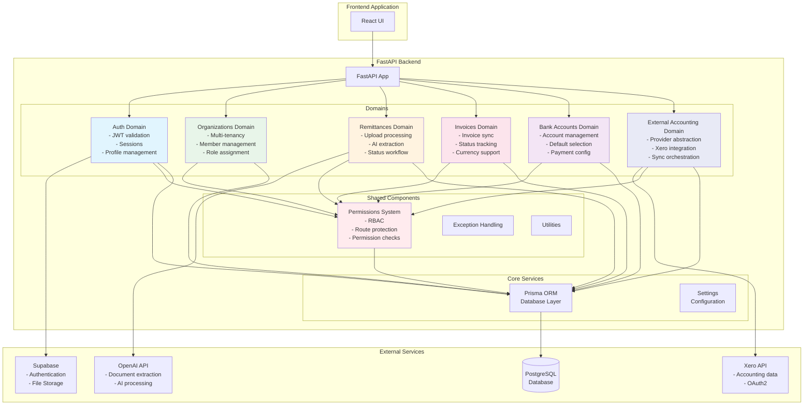
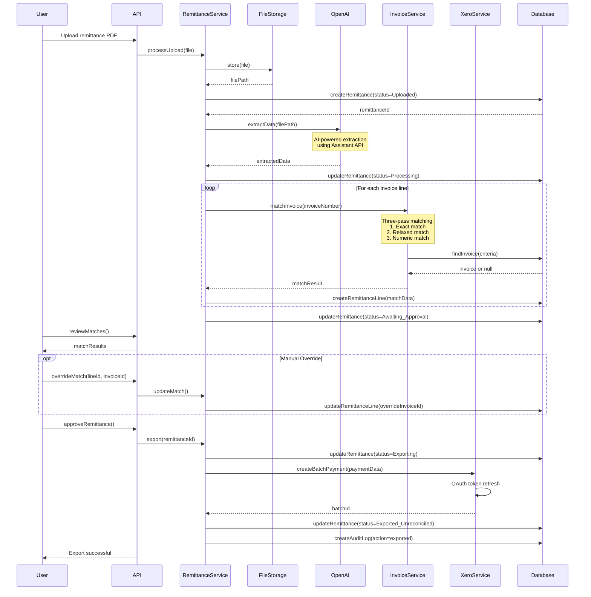
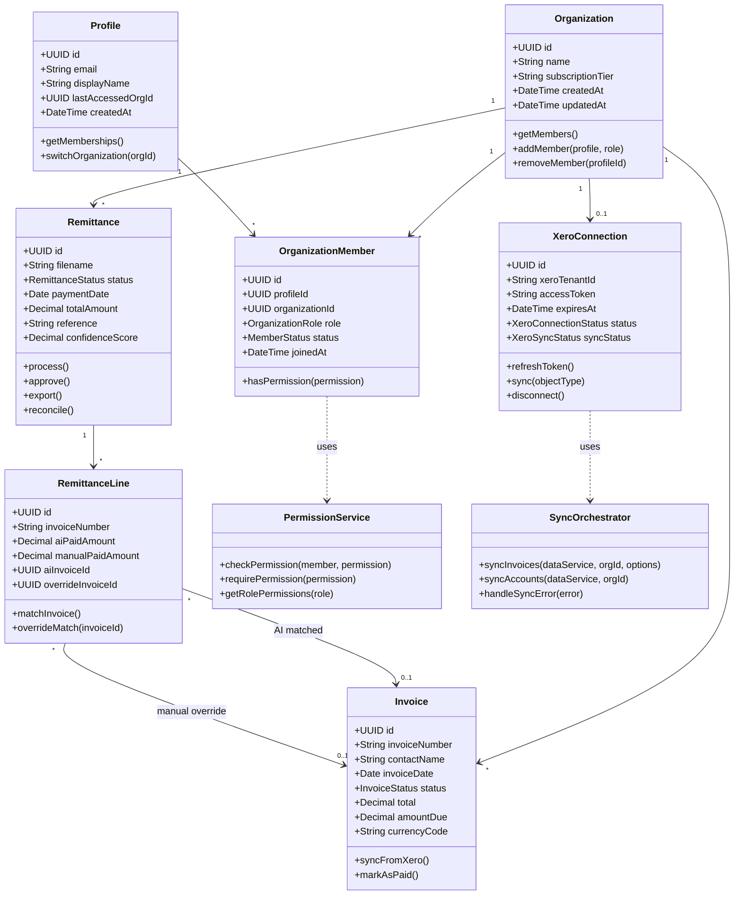
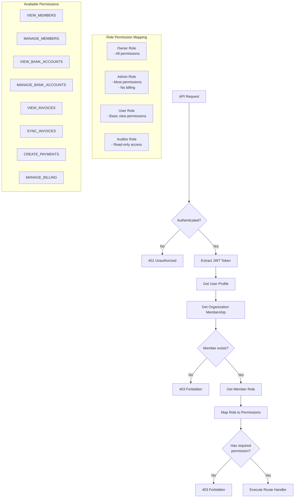
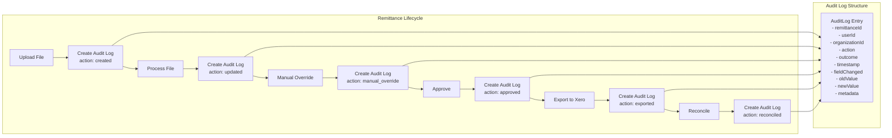

# RemitMatch v03 Architecture Diagrams

## 1. Entity Relationship Diagram - Database Schema



## 2. Architecture Component Diagram



## 3. Remittance Processing Workflow Sequence Diagram



## 4. Domain Model Class Diagram



## 5. Permission System Flow Diagram



## 6. External Accounting Integration Architecture

```mermaid
graph TB
    subgraph "API Layer"
        ROUTE[/external-accounting/*<br/>API Routes]
    end
    
    subgraph "Provider Abstraction Layer"
        FACTORY[IntegrationFactory<br/>Provider Resolution]
        BASE[BaseIntegrationDataService<br/>Abstract Interface]
        ORCH[SyncOrchestrator<br/>Generic Sync Logic]
    end
    
    subgraph "Provider Implementations"
        XERO_IMPL[XeroDataService<br/>Xero Implementation]
        FUTURE1[FutureProvider1<br/>QuickBooks/MYOB/etc]
        FUTURE2[FutureProvider2<br/>Other Providers]
    end
    
    subgraph "Provider Services"
        XERO_API[Xero API<br/>OAuth2 + REST]
        OTHER_API[Other APIs<br/>Future Providers]
    end
    
    subgraph "Database"
        CONN[(Provider Connections<br/>XeroConnection table)]
        DATA[(Synced Data<br/>Invoices, Accounts)]
        LOGS[(Sync Logs<br/>XeroSyncLog table)]
    end
    
    ROUTE --> FACTORY
    FACTORY --> BASE
    FACTORY --> CONN
    
    BASE <-.-> XERO_IMPL
    BASE <-.-> FUTURE1
    BASE <-.-> FUTURE2
    
    XERO_IMPL --> XERO_API
    FUTURE1 --> OTHER_API
    FUTURE2 --> OTHER_API
    
    ORCH --> BASE
    ORCH --> DATA
    ORCH --> LOGS
    
    style BASE fill:#e8eaf6
    style FACTORY fill:#e8eaf6
    style ORCH fill:#e8eaf6
    style XERO_IMPL fill:#c5e1a5
    style FUTURE1 fill:#ffccbc,stroke-dasharray: 5 5
    style FUTURE2 fill:#ffccbc,stroke-dasharray: 5 5
```

## 7. Invoice Matching Algorithm Flowchart

```mermaid
flowchart TD
    A[Start: Invoice Number<br/>from Remittance Line] --> B[Normalize Input<br/>- Trim whitespace<br/>- Convert to uppercase]
    
    B --> C{Exact Match?<br/>Case-insensitive}
    C -->|Yes| D[Return Match<br/>Confidence: 100%]
    C -->|No| E[Relaxed Match<br/>Remove special chars]
    
    E --> F{Relaxed Match<br/>Found?}
    F -->|Yes| G[Return Match<br/>Confidence: 85%]
    F -->|No| H[Extract Numbers Only]
    
    H --> I{Numeric Match<br/>Found?}
    I -->|Yes| J[Return Match<br/>Confidence: 70%]
    I -->|No| K[No Match Found]
    
    K --> L{Manual Override<br/>Available?}
    L -->|Yes| M[Use Override Invoice]
    L -->|No| N[Mark as Unmatched]
    
    subgraph "Matching Examples"
        EX1[Input: "INV-001"<br/>Exact: "INV-001" ✓]
        EX2[Input: "INV 001"<br/>Relaxed: "INV001" ✓]
        EX3[Input: "Invoice #001"<br/>Numeric: "001" ✓]
    end
```

## 8. Audit Trail Activity Diagram



These diagrams provide a comprehensive visual representation of the RemitMatch v03 architecture, including:

1. **Entity Relationship Diagram**: Shows the complete database schema with all relationships
2. **Architecture Component Diagram**: Illustrates the system's modular architecture and external dependencies
3. **Remittance Processing Workflow**: Details the end-to-end process from upload to reconciliation
4. **Domain Model Class Diagram**: Shows the object-oriented design of key business entities
5. **Permission System Flow**: Explains the RBAC authorization process
6. **External Accounting Integration**: Demonstrates the provider-agnostic design pattern
7. **Invoice Matching Algorithm**: Visualizes the three-pass matching logic
8. **Audit Trail Activity**: Shows how the system tracks all business actions

All diagrams follow Mermaid syntax and can be rendered using any Mermaid-compatible viewer.